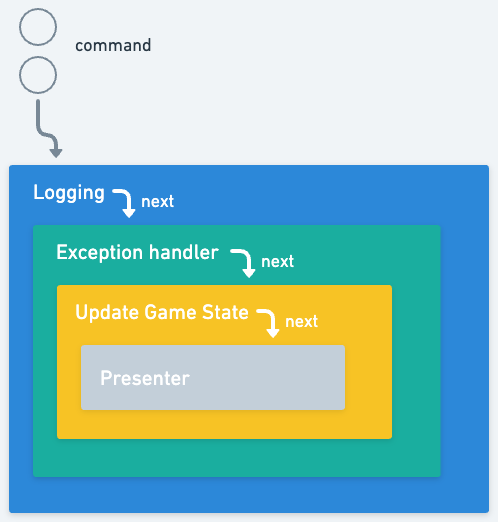
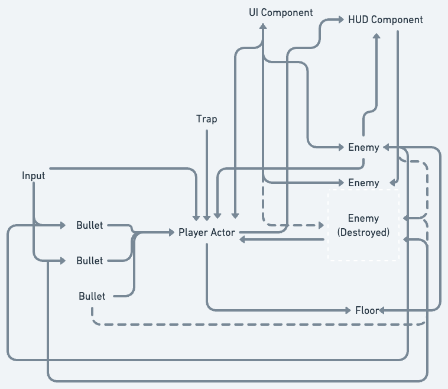
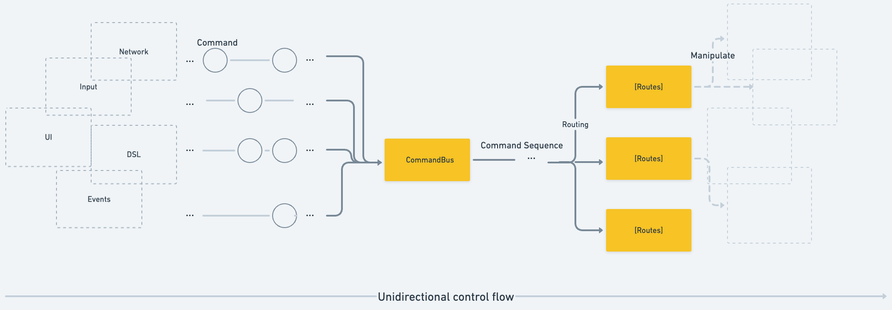

# VitalRouter

[](./LICENSE)


VitalRouter, is a zero-allocation message passing tool for Unity (Game Engine). And the very thin layer that encourages MVP (or whatever)-like design. 
Whether you're an individual developer or part of a larger team, VitalRouter can help you build complex game applications.

Bring fast, declarative routing to your application with Source Generator.

```cs
[Routes]
[Filter(typeof(Logging))]
[Filter(typeof(ExceptionHandling))]
[Filter(typeof(GameStateUpdating))]
public partial class ExamplePresenter
{
    // Declare event handler
    public void On(FooCommand cmd)
    {
        // Do something ...
    }

    // Declare event handler (async)
    public async UniTask On(BarCommand cmd)
    {
        // Do something for await ...
    }
    
    // Declare event handler with extra filter
    [Filter(typeof(ExtraFilter))]
    public async UniTask(CommandC cmd, CancellationToken cancellation)
    {
        // Do something after all filters runs on.
    }
}
```

| Feature | Description |
| ---- | ---- |
| Declarative routing | The event delivery destination and inetrceptor stack are self-explanatory in the type definition. |
| Async/non-Async handlers | Integrate with async/await (with UniTask), and providing optimized fast pass for non-async way |
| With DI and without DI | Auto-wiring the publisher/subscriber reference by DI (Dependency Injection). But can be used without DI for any project |
| Thread-safe N:N pub/sub, FIFO  | Built on top of a thread-safe, in-memory, asynchronized  pub/sub system, which is critical in game design.<br><br>Due to the async task's exclusivity control, events are characterized by being consumed in sequence. So it can be used as robust FIFO queue. |


## Table of Contents


## Installation

Prerequirements:
- Unity 2022.2+
	- This limitation is due to the use of the Incremental Source Generator.
- Install [UniTask](https://github.com/Cysharp/UniTask)
	- Currently, VitalRouter uses UniTask instead of `UnityEngine.Awaitable`. UniTask is a fully featured and fast awaitable implementation.
	- 
	- In a future, if `UnityEngine.Awaitable` is enhanced in a future version of Unity, it may be migrated.
- (optional) Install [VContainer](https://github.com/hadashiA/VContainer) 
	-  For bringing in DI style, VitalRouter supports Integration with VContainer, a fast and lightweight DI container for Unity.

Then, add git URL from Package Manager:

```
https://github.com/hadashiA/Vitalrouter.git?path=/VitalRouter.Unity/Assets/VitalRouter
```

## Getting Started

First, define the data types of the event/message you want to dispatch. In VitalRouter this is called  "command".
Any data type that implements `ICommand` will be available as a command, no matter what the struct/class/record is.

```cs
public readonly struct FooCommand : ICommand
{
    public int X { get; init; }
    public string Y { get; init; }
}

public readonly record struct BarCommand : ICommand
{
    public Guid Id { get; init; }
    public Vector3 Destination { get; init; }
}
```

Command is a data type (without any functionally). You can call it an event, a message, whatever you like.
Forget about the traditional OOP "Command pattern" :) This library is intended for data-oriented design.
The name "command" is to emphasize that it is a operation that is "published" to your game system entirely. The word is borrowed from CQRS, EventStorming etc.

In game development, the reason why the pub/sub model is used is because that any event will affect multiple sparse objects.
See [#Technical Explanation](#Hoge) section to more information.

> [!TIP]
> Here we use the init-only property for simplicity. In your Unity project, you may need to add a definition of type `System.Runtime.CompilerServices.IsExternalInit`as a marker.
> However, this is not a requirement.
> You are welcome to define the datatype any way you like.
 >Modern C# has additional syntax that makes it easy to define such data-oriented types. Using record or record struct is also a good option.
> In fact, even in Unity, you can use the new syntax by specifying `langVersion:11` compiler option or by doing dll separation.  It would be worth considering.

Next, define the class that will handle the commands.

```cs
using VitalRouter;

// Classes with the Routes attribute are the destinations of commands.
[Routes]
public partial class FooPresentor
{
    // This is called when a FooCommand is published.
    public void On(FooCommand cmd)
    {
        // Do something ...
    }

    // This is called when a FooCommand is published.
    public async UniTask On(BarCommand cmd)
    {
        // Do something for await ...
        // Here, by awaiting for async task, the next command will not be called until this task is completed.
    }
}
```
	
Types with the `[Routes]` attribute are analyzed at compile time and a method to subscribe to Command is automatically generated.

Methods that satisfy the following conditions are eligible.
- public accesibility.
-  The argument must be an `ICommand`, or `ICommand` and `CancellationToken`.
-  The return value must be `void`,  or `UniTask`.

For example, all of the following are eligible. Method names can be arbitrary.

```cs
public void On(FooCommand cmd) { /* .. */ }
public async UniTask HandleAsync(FooCommand cmd) { /* .. */ }
public async UniTask Recieve(FooCommand cmd, CancellationToken cancellation) { /* .. */ }

```

> [!NOTE] 
> There are no restrictions by Interface but it will generate source code that will be resolved at compile time, so you will be able to follow the code well enough.

Now, when and how does the routing defined here call? There are several ways to make it enable this.

### MonoBehaviour based

In a naive Unity project, the easy way is to make MonoBehaviour into Routes.

```cs
[Rouets] // < If routing as a MonoBehaviour
public class FooPresenter : MonoBehaviour
{
    void Start()
    {
        MapTo(Router.Default); // < Start command handling here 
    }
}
```

- `MapTo` is an automatically generated instance method.
- When the GameObject is Destroyed, the mapping is automatically removed.

If you publish the command as follows, `FooPresenter` will be invoked.

```cs
await Router.Default.PublishAsync(new FooCommand
{
    X = 111,
    Y = 222,
}
```

If you want to split routing, you may create a Router instance. As follows.

```cs
var anotherRouter = new Router();
```

```cs
MapTo(anotherRouter);
```

```cs
anotherRouter.PublishAsync(..)
```

### DI based

If DI is used, plain C# classes can be used as routing targets.

```cs
[Rouets] // < If routing as a plain C# class
public class FooPresenter
{
    // ...
}
```

```cs
using VContainer;
using VitalRouter;
using VitalRouter.VContainer;

// VContaner's configuration
public class GameLifetimeSCope : LifetimeScope
{
    protected override void Configure(IContainerBuilder builder)
    {
        builder.RegisterVitalRouter(routing =>
        {
            routing.Map<FooPresenter>(); // < Register routing class
        });			
    }
}
```

In this case, publisher is also injectable.

```cs
class SomeMyComponent : MonoBehaviour
{
    [SerializeField]
    Button someUIBotton;

    ICommandPublisher publisher;

    [Inject]
    public Construct(ICommandPublisher publisher)
    {
        this.publisher = publisher;
    }

    void Start()
    {
        someUIButton.onClick += ev =>
        {
            publisher.PublishAsync(new FooCommand { X = 1, Y = 2 }).Forget();
        }
    }
}
```

In this case, Just register your Component with the DI container. References are auto-wiring.

```diff
public class GameLifetimeSCope : LifetimeScope
{
    protected override void Configure(IContainerBuilder builder)
    {
+        builder.RegisterComponentInHierarchy<SomeMyComponent>(Lifetime.Singleton);
	
        builder.RegisterVitalRouter(routing =>
        {
            routing.Map<FooPresenter>();
        });			
    }
}

```

> [!NOTE]
> This is a simple demonstration.
> If your codebase is huge, just have the View component notify its own events on the outside, rather than Publish directly. And maybe only the class responsible for the control flow should Publish.

### Manually 

You can also set up your own entrypoint without using `MonoBehaviour` or a DI container.

```cs
var presenter = new FooPresenter();
presenter.MapTo(Router.Default);
```

In this case, unmapping is required manually to discard the FooPresenter.
```cs
presenter.UnmapRoutes();
```

Or, handle subscription.

```cs
var subscription = presenter.MapTo(Router.Default);
// ...
subscription.Dispose();
```

## Publish

`ICommandPublisher` has an awaitable publish method.

```cs
ICommandPublisher publisher = Router.Default;

await publisher.PublishAsync(command);
await publisher.PublishAsync(command, cancellationToken);
```


If you await `PublishAsync`, you will await until all Subscribers (`[Routes]` class etc.) have finished all processing.
Also note that the next command will not be delivered until all `[Routes]` classes and Interceptors have finished processing the Command.

```cs
publisher.PublishAsync(command1).Forget();
publisher.PublishAsync(command2).Forget(); // Queue behind command1
publisher.PublishAsync(command3).Forget(); // Queue behind command2
// ...
```

The following is same for the above.

```cs
publisher.Enqueue(command1);
publisher.Enqueue(command2);
publisher.Enqueue(command3);
// ...
```

`Enqueue` is an alias to `PublishAsync(command).Forget()`.

In other words, per Router, command acts as a FIFO queue for the async task.

Of course, if you do `await`, you can try/catch all subscriber/routes exceptions.

```cs
try
{
    await publisher.PublishAsync(cmd);
}
catch (Exception ex)
{
    // ...
}
```

## Interceptors

Interceptors can intercede additional processing before or after the any published command has been passed and consumed to subscribers.		



### Create a interceptor

Arbitrary interceptors can be created by implementing `ICommandInterceptor`.

Example 1:  Some kind of processing is interspersed before and after the command is consumed.

```cs
class Logging : ICommandInterceptor
{
    public async UniTask InvokeAsync<T>(  
        T command,  
        CancellationToken cancellation,  
        Func<T, CancellationToken, UniTask> next)  
        where T : ICommand  
    {  
        UnityEngine.Debug.Log($"Start {typeof(T)}");	
        // Execute subsequent routes.	
        await next(command, cancellation);		
        UnityEngine.Debug.Log($"End   {typeof(T)}");
    }		
}
```

Example 2:  try/catch all subscribers exceptions.

```cs
class ExceptionHandling : ICommandInterceptor
{
    public async UniTask InvokeAsync<T>(  
        T command,  
        CancellationToken cancellation,  
        Func<T, CancellationToken, UniTask> next)  
        where T : ICommand  
    {  
        try
        {
            await next(command, cancellation);
        }
        catch (Exception ex)
        {
            // Error tracking you like			
            UnityEngine.Debug.Log($"oops! {ex.Message}");			
        }
    }		
}
```

Example 3:  Filtering command.

```cs
class MyFilter : ICommandInterceptor
{
    public async UniTask InvokeAsync<T>(  
        T command,  
        CancellationToken cancellation,  
        Func<T, CancellationToken, UniTask> next)  
        where T : ICommand  
    {  
        if (command is FooCommand { X: > 100 } cmd) 
        {
            // Deny. Skip the rest of the subscribers.
            return;
        }
        // Allow.
        await next(command, cancellation);
    }		
}
```
### Configure interceptors

There are three levels to enable interceptor

1. Apply globally to the `Router`. 
2. Apply it to all methods in the `[Routes]` class.
3. Apply only to specific methods in the `[Routes]` class.

```cs
// Apply to the router.
Router.Default
    .Filter(new Logging());
    .Filter(new ErrorHandling);
```

```cs
// 1. Apply to the router with VContaienr.
builder.RegisterVitalRouter(routing => 
{
    routing.Filters.Add<Logging>();
    routing.Filters.Add<ErrorHandling>();
});
```

```cs
// 2. Apply to the type
[Routes]
[Filter(typeof(Logging))]
public partial class FooPresenter
{
    // 3. Apply to the method
    [Filter(typeof(ExtraInterceptor))]
    public void On(CommandA cmd)
    {
        // ...
    }
}
```

All of these are executed in the order in which they are registered, from top to bottom.

If you take the way of 2 or 3, the Interceptor instance is resolved as follows.

- If you are using DI, the DI container will resolve this automatically.
- if you are not using DI, you will need to pass the instance in the `MapTo` call.

```cs
MapTo(Router.Default, new Logging(), new ErrorHandling());
```
 
```cs
// auto-generated
public Subscription MapTo(ICommandSubscribable subscribable, Logging interceptor1, ErrorHandling interceptor2) { /* ... */ }
```

## DI scope

VContainer can create child scopes at any time during execution.

`RegisterVitalRouter` inherits the Router defined in the parent. 
For example,

```cs
public class ParentLifetimeScope : LifetimeScope  
{  
    protected override void Configure(IContainerBuilder builder)  
    {    
        builder.RegisterVitalRouter(routing =>  
        {  
            routing.Map<PresenterA>();  
        });
        
        builder.Register<ParentPublisher>(Lifetime.Singleton);
    }  
}
```

```cs
public class ChildLifetimeScope : LifetimeScope  
{  
    protected override void Configure(IContainerBuilder builder)  
    {    
        builder.RegisterVitalRouter(routing =>  
        {  
            routing.Map<PresenterB>();  
        });  
        
        builder.Register<MyChildPublisher>(Lifetime.Singleton);
    }  
}
```

- When an instance in the parent scope publishes used `ICommandPublisher`, PresenterA and PresenterB receive it.
- When an instance in the child scope publishes `ICommandPublisher`, also PresenterA and PresenterB receives.

If you wish to create a dedicated Router for a child scope, do the following.

```diff
builder.RegisterVitalRouter(routing =>  
{
+    routing.OverrideRouter = true;
    routing.Map<PresenterB>();  
});  
```

## Command Pooling

If Command is struct, VitalRouter avoids boxing, so no heap allocation occurs. This is the reson of using sturct is recommended.

In some cases, however, you may want to use class.
Typically, when Command is treated as a collection element, boxing is unavoidable.

So we support the ability to pooling commands when classes are used.

```cs
public class MyBoxedCommmand : IPoolableCommand
{
    public ResourceA ResourceA { ge; set; }

    void IPoolableCommand.OnReturnToPool()
    {
        ResourceA = null!;
    }
}
```

### Rent from pool

```cs
// To publish, use CommandPool for instantiation.
var cmd = CommandPool<MyBoxedCommand>.Shared.Rent(() => new MyBoxedCommand());

// Lambda expressions are used to instantiate objects that are not in the pool. Any number of arguments can be passed from outside.
var cmd = CommandPool<MyBoxedCommand>.Shared.Rent(arg1 => new MyBoxedCommand(arg1), extraArg);
var cmd = CommandPool<MyBoxedCommand>.Shared.Rent((arg1, arg2) => new MyBoxedCommand(arg1, arg2), extraArg1, extraArg2);
// ...

// Configure value
cmd.ResourceA = resourceA;

// Use it
publisher.PublishAsync(cmd);
```

### Return to pool

```cs
// It is convenient to use the `CommandPooling` Interceptor to return to pool automatically.
Router.Default.Filter(CommandPooling.Instance);


// Or, return to pool manually.
CommandPool<MyBoxedCommand>.Shard.Return(cmd);
```

## Sequence Command

If your command implements `IEnumerable<ICommand>`, it represents a sequence of time series.

```cs
var sequenceCommand = new SequenceCommand
{
    new CommandA(), 
    new CommandB(), 
    new CommandC(),
    // ...
}
```

## Fan-out

If you want to create a group that executes in concurrent, you can create a composite router.

```cs
public class CompositeRouter : ICommandPublisher
{
    public Router GroupA { get; } = new();
    public Ruoter GroupB { get; } = new();
   
    readonly UniTask[] tasks = new UniTask[2];

    public async UniTask PublishAsync<T>(T command, CancellationToken cancellation = default) where T : ICommand
    {
        tasks[0] = GroupA.PublishAsync(command, cancellation);
        tasks[1] = GroupA.PublishAsync(command, cancellation);
        await UniTask.WhenAll(tasks)
        Array.Clear(tasks, 0, tasks.Length);
    }
}
```

For DI,

```cs
public class SampleLifetimeScope : LifetimeScope
{
    public override void Configure(IContainerBuilder builder)
    {
        var compositeRouter = new CompositeRouter();
        
        builder.RegisterVitalRouter(compositeRouter.GroupA, routing =>
        {
            routing.Map<PresenterA>();
            routing.Map<PresenterB>();
        });
        
        builder.RegisterVitalRouter(compositeRouter.GroupA, routing =>
        {
            routing.Map<PresenterA>();
            routing.Map<PresenterB>();
        });
        
        builder.RegisterInsatnce(compositeRouter)
            .AsImplementedInterfaces()
            .AsSelf()
    }
}
```

## Concept, Technical Explanation

### Unidirectional control flow

Unity is a very fun game engine that is easy to work with, but handling communication between multiple GameObjects is a difficult design challenge.

In the game world, there are so many objects working in concert: UI, game system, effects, sounds, and various actors on the screen.

It is common for an event fired by one object to affect many objects in the game world.
If we try to implement this in a naive OOP way, we will end up with complex... very complex N:N relationships.

More to the point, individual objects in the game are created and destroyed at a dizzying rate during execution, so this N:N would tend to be even more complex!



There is one problem. There is no distinction between "the one giving the orders" and "the one being given the orders."
In the simplicity of Unity programming, it is easy to mix up the person giving the orders and the person being given the orders.
This is one of the reasons why game design is so difficult.

When the relationship is N:N, bidirectional binding is almost powerless. This is because it is very fat for an object to resolve references to all related objects. Moreover, they all repeat their creation.

Most modern GUI application frameworks recommend an overall unidirectional control flow rather than bidirectional binding.
Games are more difficult to generalize than GUIs. However, it is still important to organize the "control flow.



### Presentation Domain Separation

A major concern in game development is creating a Visualize Component that is unique to that game.

The Component we create has very detailed state transitions. It will move every frame. Maybe.
It will have complex parent-child relationships. Maybe.

But we should separate this very detailed state management from the state that is brought to the entire game system and to which many objects react.


It is the latter fact that should be "publich".

Each View Component should hide its own state inside.


The "Controller" in MVC is essentially not controlled by anyone. It is the entry point of the system.
VitalRouter does not require someone to own the Controller, only to declare it in an attribute. So it encourages this kind of design.

### Data-oriented

An important advantage of giving a type for each type of event is that it is serializable.

For example,
- If you store your commands in order, you can implement game replays later by simply re-publishing them in chronological order.
- Commands across the network, your scenario data, editor data, whatever is datamined, are the same input data source.

A further data-oriented design advantage is the separation of "data" from "functionality.

The life of data is dynamic.
Data is created/destroyed when certain conditions are met in a game.
On the other hand, "functionality" has a static lifetime.
This is a powerful tool for large code bases.
 
## LISENCE

MIT

## AUTHOR

@hadashiA
